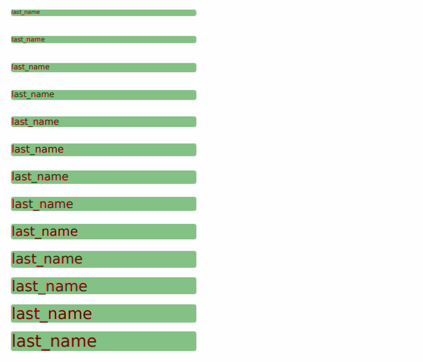

<br />
<p align="center">
  <a href="https://github.com/github_username/repo_name">
    
  </a>

  <h3 align="center">Шаблонизация PDF</h3>
</p>


## О проекте

Если в вашем проекте есть бланки pdf, в которые необходимо динамически впечатывать
данные, то данное, небольшое веб приложение позволит в игровой форме задать необходимые
позиции, впечатываемым полям, и выдать заполненный pdf документ.

В общем случае можно формировать комплект документов из нескольких разных бланков,
скомпонованных в нужном количестве, в нужном порядке.


### Приложение построено на

* [nginx]
* [python3.8]
* [pdfrw](https://pypi.org/project/pdfrw/)
* [jquery](https://jquery.com/)
* [jquery-ui](https://jqueryui.com/)


## Установка приложения

Сделайте себе локальную копию проекта. Например:
  ```bash
  git clone git@github.com:metron/tpdf.git
  ```

### Устанавливаем виртуальное окружение и зависимости

  ```bash
  cd tpdf
  virtualenv venv --no-download
  source venv/bin/activate
  pip install -r requirements.txt
  ```

### Настраиваем nginx

Наверное инструкция по установке nginx не нужна, после установки nginx нужно настроить
статические пути к проекту и перенаправление запросов на 8001 порт приложения.

  ```nginx
  server {
      listen 80;
      listen [::]:80;
  
      server_name 127.0.0.1;
  
      location / {
          proxy_set_header Host $http_host;
          proxy_set_header X-Forwarded-For $proxy_add_x_forwarded_for;
          proxy_redirect off;
          proxy_buffering off;
          proxy_pass http://127.0.0.1:8001;
      }
  
      location /static/ {
          root /home/user/source/tpdf/;
      }
  }
  ```


## Использование

Запускаем nginx и запускаем приложение:
  ```bash
  python3 main.py    
  ```

### Просто посмотреть
Открываем в браузере, для примера, позиционирование полей тестового бланка
(ZayavlenieNaZagranpasport)
  ```angular2html
  http://127.0.0.1/tpdf/positioning?pdf_name=ZayavlenieNaZagranpasport&page_num=1
  ```

Настраиваем положение полей в браузере с помощью мышки и сохраняем позиции.
Открываем получившийся комплект документов
  ```angular2html
  http://127.0.0.1/tpdf/example
  ```

### Добавить новый документ
1. Делаем копию каталога с примером документа:
  ```angular2html
  cp libs/tpdf_templates/ZayavlenieNaZagranpasport libs/tpdf_templates/NewName -R
  ```
2. Подменяем в новой директории файл бланка form.pdf на нужный бланк
3. Удаляем тестовую картинку и добавляем необходимые картинки в подпапку images
4. В файле fields.json заполняем набор полей, который должен быть впечатан в документ.
 При этом вручную нужно указать только имена полей, размер шрифта и имя шрифта, 
 координаты полей и максимальная ширина поля будут вычислены автоматически.
   
5. Создаём новый url метод, который будет генерировать новый документ, для этого в
файле main.py копируем строку
  ```angular2html
  web.get('/tpdf/example', tpdf.example),
  ```
Например на:
  ```angular2html
  web.get('/tpdf/new_name', tpdf.new_name),
  ```
6. В файле handlers/tpdf.py копируем метод example на метод new_name, заполняем в этом
   методе данными необходимые поля. Обратите внимание, что в основном классе Tpdf можно
   вычислять новые поля. Например, в класс мы передаём поля last_name, first_name,
   second_name, а в файле fields.json указываем поле fio, которое вычисляется внутри
   класса Tpdf на основе первых трёх полей. Так можно поступать не только с ФИО.
   
7. Перезапускаем приложение, открываем файл с целью позиционирования полей
  ```angular2html
  http://127.0.0.1/tpdf/positioning?pdf_name=NewName&page_num=1
  ```
8. Позиционируем поля и сохраняем нужные позиции по кнопке, координаты попадут в файл
   fields.json
   
9. Тонкие настройки полей (выравнивание по осям и ширине полей) делаем прямо в файле
   fields.json, который специально генерируется в удобном для редактирования виде,
   причём поля сортируются по оси Y.

10. Открываем итоговый документ, с заполненными данными по адресу
  ```angular2html
  http://127.0.0.1/tpdf/new_name
  ```


## Контакт

Аким Негрей - metron19 собака яндекс точка ру - email
