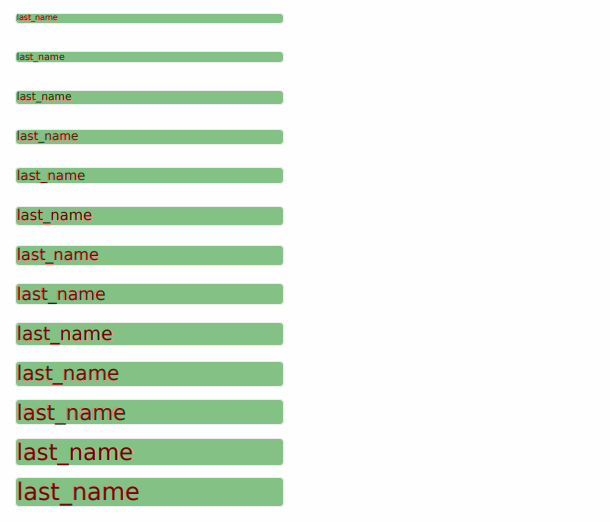

<br />
<p align="center">
  <a href="https://github.com/github_username/repo_name">
    
  </a>

  <h3 align="center">Шаблонизация PDF</h3>
</p>


## О проекте

Если в вашем проекте есть бланки pdf, в которые необходимо динамически впечатывать
данные, то данное, небольшое веб приложение позволит в простым способом задать необходимые
позиции, впечатываемым полям, и выдать заполненный pdf документ.

В общем случае можно формировать комплект документов из нескольких разных бланков,
скомпонованных в нужном количестве, в нужном порядке.

Можно также массово впечатать данные из xlsx файла в pdf файл


### Приложение построено на

* [python3.8]
* [pdfrw](https://pypi.org/project/pdfrw/)
* [jquery](https://jquery.com/)
* [jquery-ui](https://jqueryui.com/)


## Установка приложения

Сделайте себе локальную копию проекта. Например:
  ```bash
  git clone git@github.com:metron/tpdf.git
  ```

### Устанавливаем виртуальное окружение и зависимости

  ```bash
  cd tpdf
  virtualenv venv --no-download
  source venv/bin/activate
  pip install -r requirements.txt
  ```

## Использование

Запускаем приложение:
  ```bash
  python3 index.py    
  ```

### Просто посмотреть
Открываем в браузере главную страницу
  ```angular2html
  http://127.0.0.1:8001
  ```
На главной странице отображаются имена директорий (=документов) и три ссылки:
- Настройка полей - позиционирование полей на странице pdf
- Просмотр полей - просмотр pdf документа с именами полей вместо данных
- Итоговый pdf - просмотр итогового pdf документа с данными из xlsx файла

### Добавить новый шрифт
1. Положить файл шрифта, с расширением ttf в папку static/fonts и можно им пользоваться:
    - Перезапустить приложение
    - Использовать шрифт в файле настроек полей, fields.json из пункта 4 предыдущего раздела документации

### Впечатать данные xlsx файла в pdf документ
Впечатывание данных xlsx файла можно посмотреть на примере директории app/try_xlsx, пошагам нужно сделать следующее: 
1. Создать новую директорию в папке app/tpdf_templates:
  ```angular2html
  mkdir app/tpdf_templates/my_document
  ```
2. Помещаем в эту директорию два файла:
 - form.pdf - файл бланк документа, без данных, в который нужно внести данные
 - data.xlsx - файл с данными, которые нужно впечатать
Формат файла data.xlsx можно посмотреть в примере try_xlsx, суть:
 - первая строка файла data.xlsx должна содержать номер страницы в документе pdf
 - вторая строка файла data.xlsx должна содержать названия полей, которые нужно впечатать
 - третья и последующие строки содержат данные, которые нужно впечатать, соответственно названием полей во второй строке

3. Перезапускаем (запускаем) приложение, открываем главную страницу
  ```angular2html
  http://127.0.0.1:8001
  ```
Там появляются 3 ссылки напротив имени, которое создали в пункте 1 - my_document: Настройка полей, Просмотр полей, Итоговый pdf
4. Проходим по ссылке "Настройка полей" и настраиваем положение и ширину полей, нажимаем "Сохранить позиции".
5. Если необходимо изменить размер и тип шрифта - открываем файл fields.json и меняем руками название шрифта, и следующий
за ним параметр - размер шрифта. Файл fields.json формируется при открытии главной страницы приложения http://127.0.0.1:8001;
По умолчанию задаётся шрифт "Times New Roman" размером 10 единиц.
6. Возвращаемся на главную страницу приложения. Проходим по ссылке "Итоговый pdf" - документ с заполненными данными готов.


### Добавить новый документ (без xlsx данных, с данными изнутри приложения)
1. Делаем копию каталога с примером документа:
  ```angular2html
  cp libs/tpdf_templates/ZayavlenieNaZagranpasport libs/tpdf_templates/NewName -R
  ```
2. Подменяем в новой директории файл бланка form.pdf на нужный бланк
3. Удаляем тестовую картинку и добавляем необходимые картинки в подпапку images
4. В файле fields.json заполняем набор полей, который должен быть впечатан в документ.
 При этом нужно указать имена полей, размер шрифта и имя шрифта. 
 Координаты полей и максимальную ширину полей можно указать любые в пределах страницы,
 они будут вычислены автоматически в процессе настройки полей в браузере.
   
5. Создаём новый url метод, который будет генерировать новый документ, для этого в
файле index.py копируем строку
  ```angular2html
  web.get('/tpdf/example', tpdf.example),
  ```
Например на:
  ```angular2html
  web.get('/tpdf/new_name', tpdf.new_name),
  ```
6. В файле app/tpdf.py копируем метод example на метод new_name, заполняем в этом
   методе данными необходимые поля. Обратите внимание, что в основном классе Tpdf можно
   вычислять новые поля. Например, в класс мы передаём поля last_name, first_name,
   second_name, а в файле fields.json указываем поле fio, которое вычисляется внутри
   класса Tpdf на основе первых трёх полей. Так можно поступать не только с ФИО.
   
7. Перезапускаем приложение, открываем файл с целью позиционирования полей
  ```angular2html
  http://127.0.0.1:8001/tpdf/positioning?dir_name=NewName&page_num=1
  ```
8. Позиционируем поля и сохраняем нужные позиции по кнопке, координаты попадут в файл
   fields.json
   
9. Тонкие настройки полей (выравнивание по осям и ширине полей) делаем прямо в файле
   fields.json, который специально генерируется в удобном для редактирования виде,
   причём поля сортируются по оси Y.

10. Открываем итоговый документ, с заполненными данными по адресу
  ```angular2html
  http://127.0.0.1:8001/tpdf/new_name
  ```

## Контакт

Аким Негрей - телеграм: @mimetron (обратная связь приветствуется)
